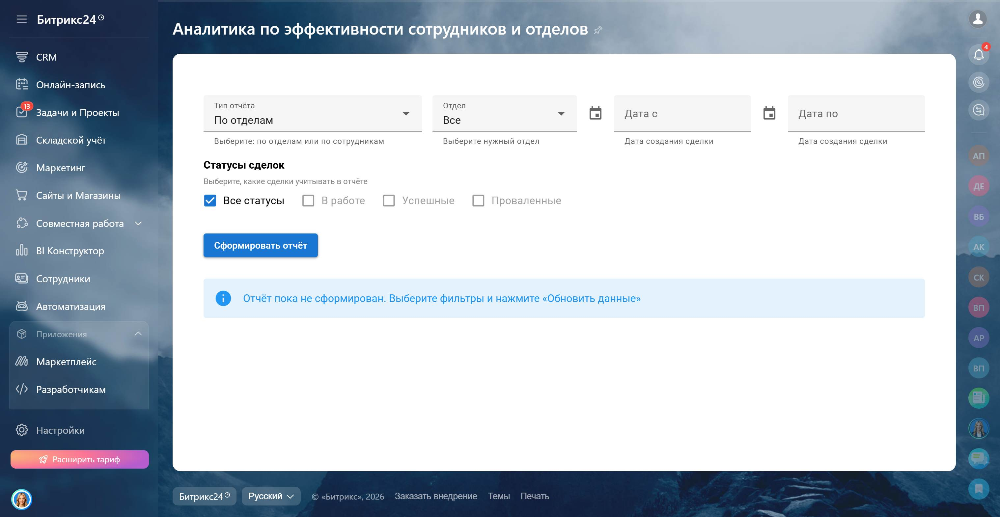
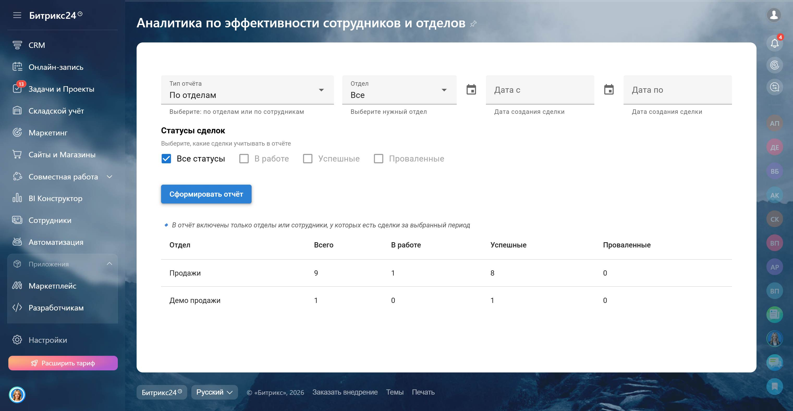
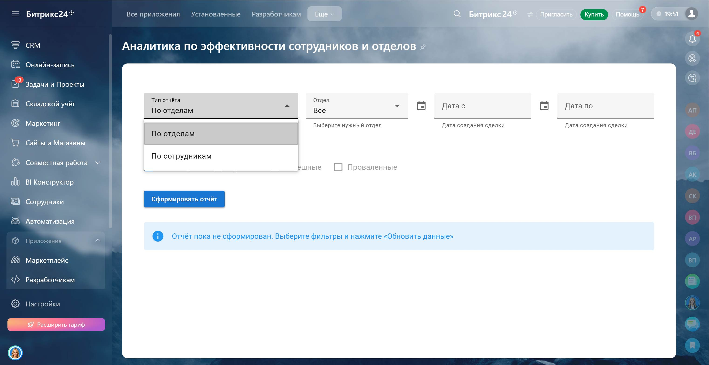
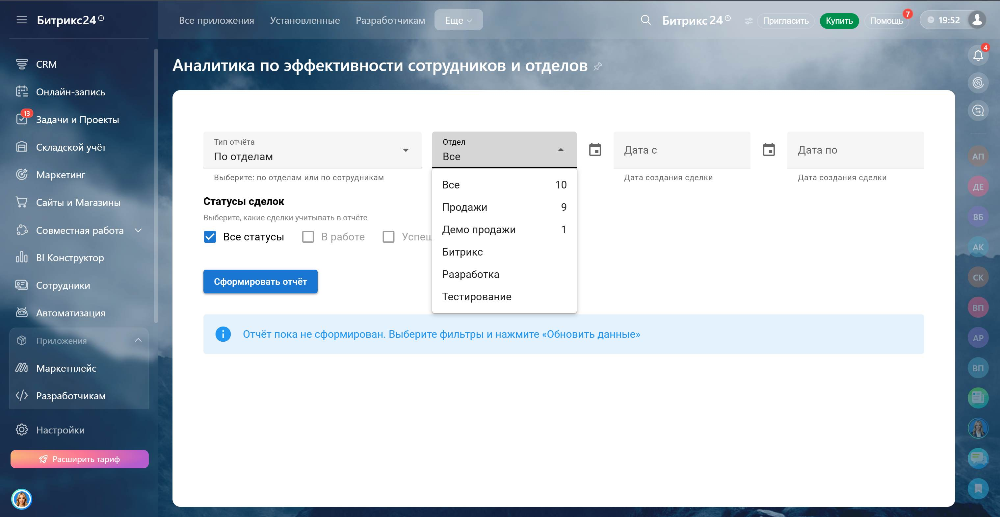
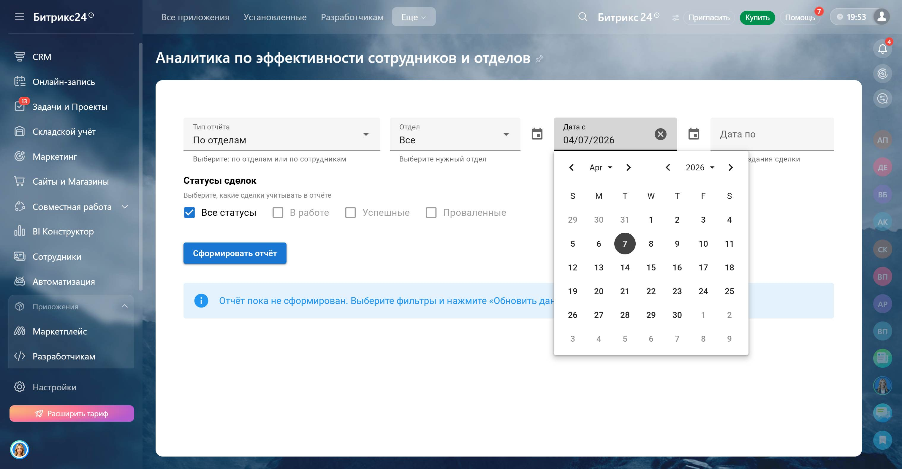
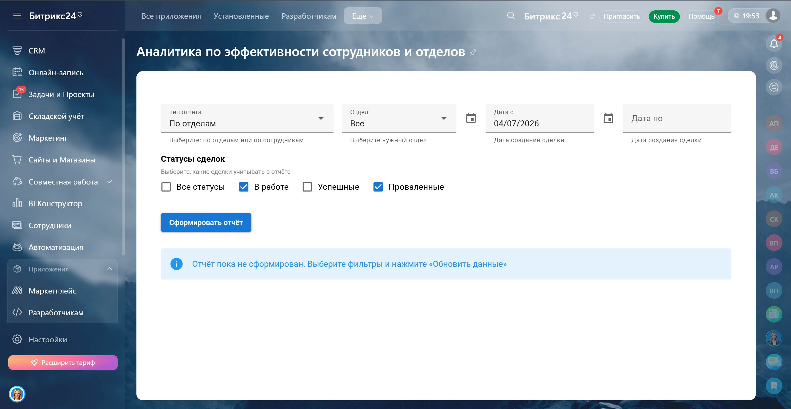

<h1 align="center">Отчет по эффективности сотрудников и отделов 📊</h1> 
 Инструмент для анализа эффективности работы сотрудников и отделов в <b>Bitrix24</b>.  Позволяет отслеживать статус сделок и оценивать результативность команды за выбранный период. 
 
 <b>📊 Анализ эффективности • 💼 Оценка работы команды • 🏆 Выявление лидеров по результату</b> 
 
 <h2>🎥 Демонстрация</h2> 
 <table width="100%" cellpadding="1" border="1"> <tr align="center"> <td>   <em>Работа приложения в реальном времени</em> </td> </tr> </table> 
   <table width="100%"> <tr> <td align="center">   <em>Начальный экран</em> </td> <td align="center">   <em>Вывод данных</em> </td> </tr> <tr> <td align="center">   <em>Выбор типа отчета</em> </td> <td align="center">   <em>Фильтрация по нужному отделу</em> </td> </tr> <tr> <td align="center">   <em>Фильтрация по дате</em> </td> <td align="center">   <em>Фильтрация по статусам сделок</em> </td> </tr> </table> 
 <h2>🧩 Контекст задачи</h2> 
 Клиенту было важно видеть эффективность работы сотрудников и отделов, понимать, сколько сделок находится в работе, успешно завершено или провалено, и анализировать результативность команды за выбранный период. 
 
 <h2>💡 Что было реализовано</h2> <ul> <li>Сбор аналитики по сделкам в разрезе сотрудников и отделов</li> <li>Разделение сделок по статусам: в работе, успешно завершенные, проваленные</li> <li>Оценка эффективности работы команды</li> <li>Гибкая фильтрация и режим отображения данных</li> </ul> 
 <h2>⚙️ Логика работы</h2> <ul> <li>Отчёт показывает эффективность работы каждого сотрудника и отдела</li> <li>Фильтры по статусу сделки, периоду и типу отображения (сотрудники/отделы)</li> <li>Визуально видно сильные и слабые зоны команды для принятия решений</li> </ul> 
 <h2>📊 Метрики отчета</h2> <table> <tr> <th>Показатель</th> <th>Описание</th> </tr> <tr> <td>Сотрудник / Отдел</td> <td>Ответственный сотрудник или отдел</td> </tr> <tr> <td>Всего сделок</td> <td>Общее количество сделок</td> </tr> <tr> <td>В работе</td> <td>Сделки, находящиеся в процессе</td> </tr> <tr> <td>Заключенные</td> <td>Успешно завершенные сделки</td> </tr> <tr> <td>Проваленные</td> <td>Неуспешные сделки</td> </tr> </table> 
<b>Фильтры:</b>
 <ul> <li>Статус сделки</li> <li>Режим отображения (по сотрудникам / по отделам)</li> <li>Период (по дате создания сделки)</li> </ul> 
 <h2>🛠 Технологический стек</h2> <table width="100%" cellpadding="10"> <tr> <td align="center">   <b>Vue.js</b> </td> <td align="center">   <b>Vuetify</b> </td> <td align="center">   <b>TypeScript</b> </td> <td align="center">   <b>Vite</b> </td> <td align="center">   <b>CSS</b> </td> <td align="center">   <b>Bitrix24 REST API</b> </td> </tr> </table> 
 <h2>📩 Контакты</h2> 
 Telegram: <a href="https://t.me/volodin7ergey">@volodin7ergey</a>  VK: <a href="https://vk.com/volodin7ergey">vk.com/volodin7ergey</a> 
 
 <b>Готов разработать аналогичные решения и бизнес-инструменты под Ваши процессы 💼</b> 
